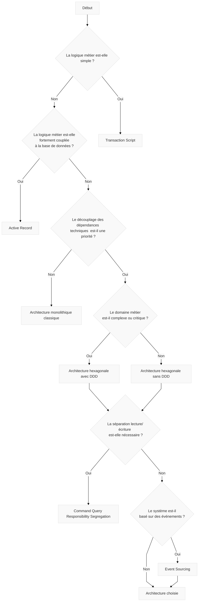

+++
title = "How to refactor code during tdd "
description = ""
date = 2024-10-07
featured = false
draft = false
comment = true
toc = true
reward = true
pinned = false
categories = [
"quality", "test", "TDD", "refactor"
]
tags = [
""
]
series = [
  "How-To"
]
images = []
+++
{{ if .Page.Store.Get "hasMermaid" }}
  
{{ end }}

## Avant-propos

Ce post est un "aide-mémoire" pour choisir l'architecture appropriée à votre application.
Les architectures citées sont les plus communes

## Arbre de décision

-how-to-choose-an-application-architecture

`#`

Event sourcing  => asynchrone ou découplé  event sourcing
