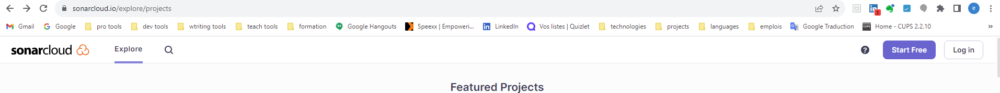
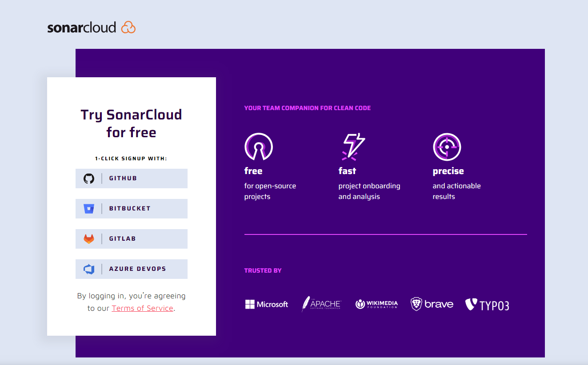
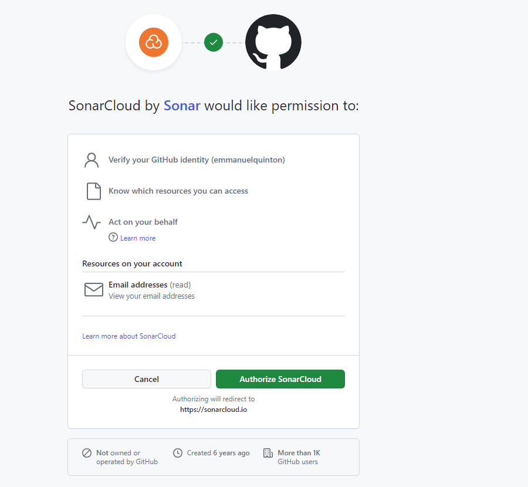
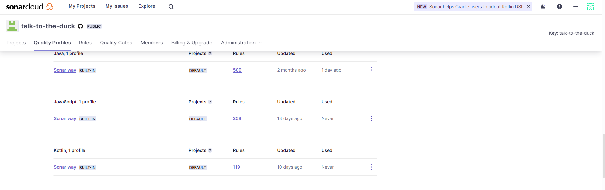
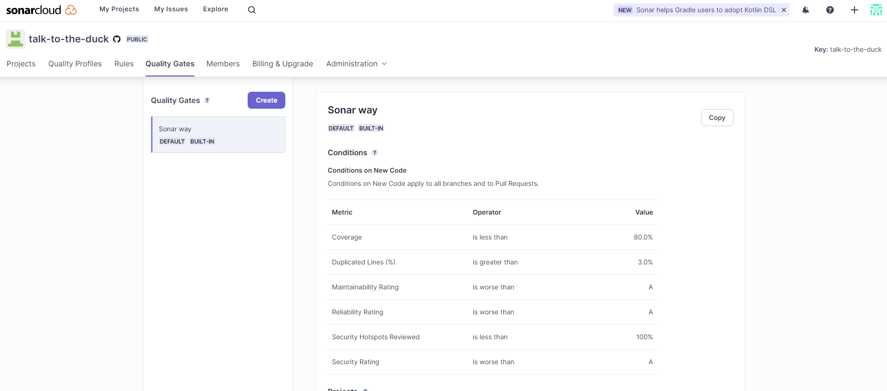
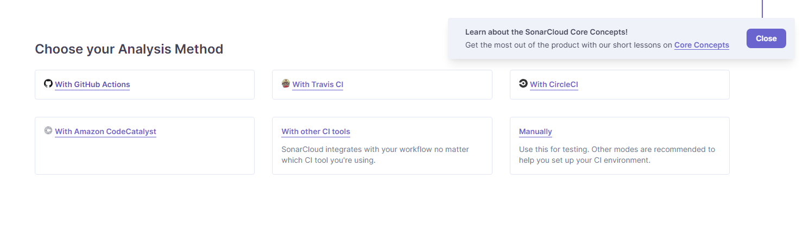

+++
title = "How-To: Use Sonarcloud "
description = ""
date = 2023-05-29
featured = false
draft = false
comment = true
toc = true
reward = true
pinned = false
categories = [
"How-To", "quality", "Sonarqube"
]
tags = [
  "How-To"
]
series = [
"How-To"
]
images = []
+++

<!--more-->
## Foreword

SonarCloud is a cloud-based code analysis service designed to detect coding issues  (cf. [SonarCloud presentation](https://docs.sonarcloud.io/))
SonarCloud is free for public projects.

## Create an Organization

In SonarCloud an account is called "authorization". To create one follow the steps below: 

* go to the Sonarcloud (page)[https://sonarcloud.io/explore/projects]  and click on "Start free" button

* Create account on Sonarcloud  fom login 

* authorize Sonarcloud to connect to your source code manager

Once the authorization given , you will be redirected to page project of your organization and if you have a public projects these display here

## Sonar's concept

It defines concepts like :
* projects
* quality profil
* quality gate

### project

The quality profile is the association of rules with a severity for a given language.

### Rules

### quality profil

The quality profile, is a for a language, some rules, each associated to a severity. 
To access to different existing profiles, go to your authorization and in 'Quality Profile' tab.

To create a new profil, the simpler way, is copying an existing profil.

### quality gate
A quality gate is a definition of the minimal quality attended by the new code and/or by the existing code.
The quality gate is said to fail when one of parameters is not respected.

All quality gates are listed in 'Quality Gates' tab. 
A new Quality Gate can be created copying and updating an existing quality gate, or create from crash via the 'Create' button 

In your CICD if your job, running sonarqube, can't fail then the pipeline will be failed if the quality gate is not respected.

## Run first analyze

Once the project has been created, SonarCloud offers to launch the first analysis via different ways.

For the GitHub public project, we can use GitHub actions. If you want to use an external tool like Gradle you can select _With other CI tools_'

You can find the different ways to analyze your project from the _Administration/Analysis method_ menu

## Summary
In this post we learnt:
* the SonarCloud concepts.
* how to create an organization.
* execute the first analyze.

If you have any remarks on the content or the form, you can leave a comment…it is by exchanging that we progress.