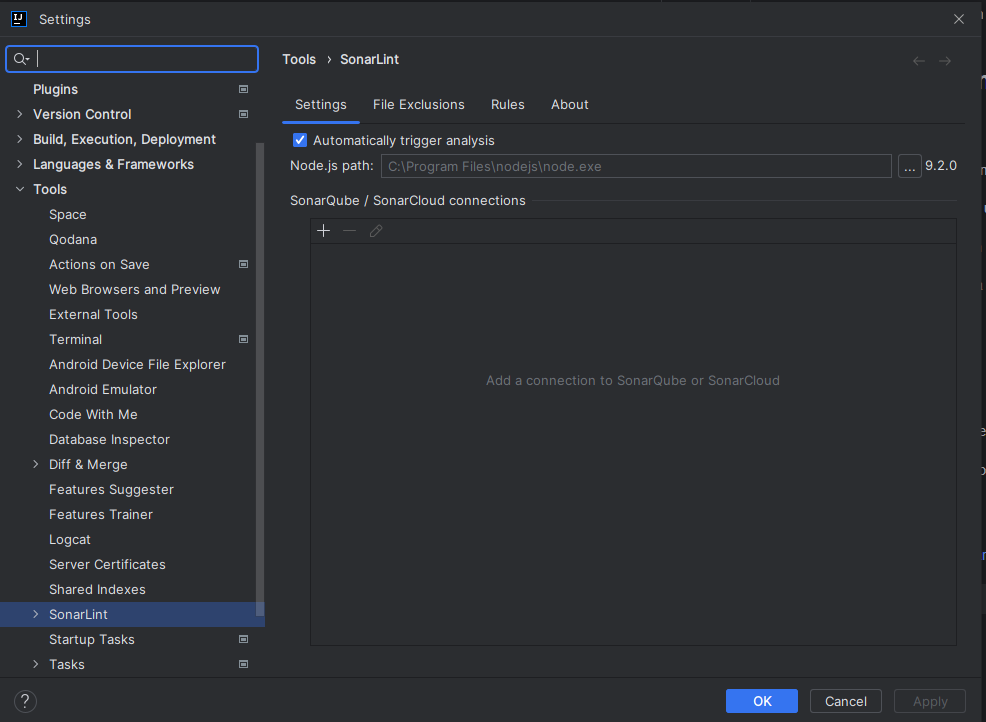
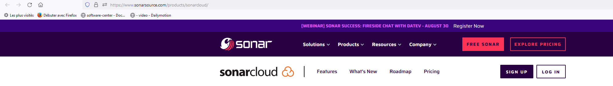
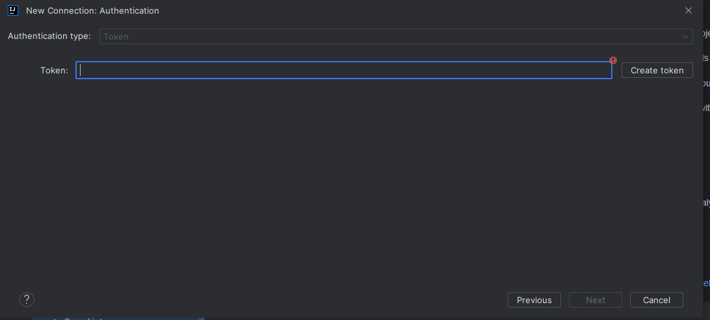
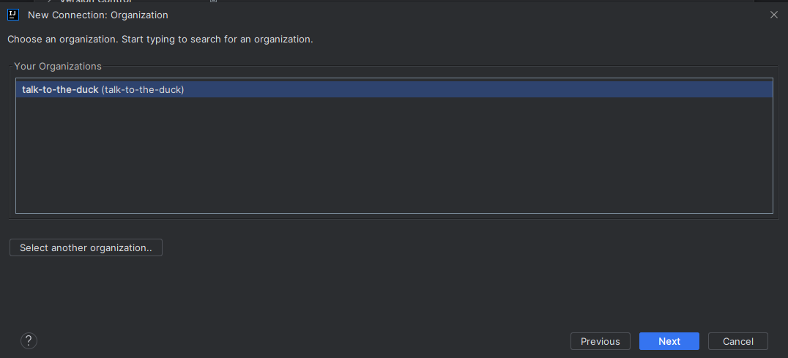
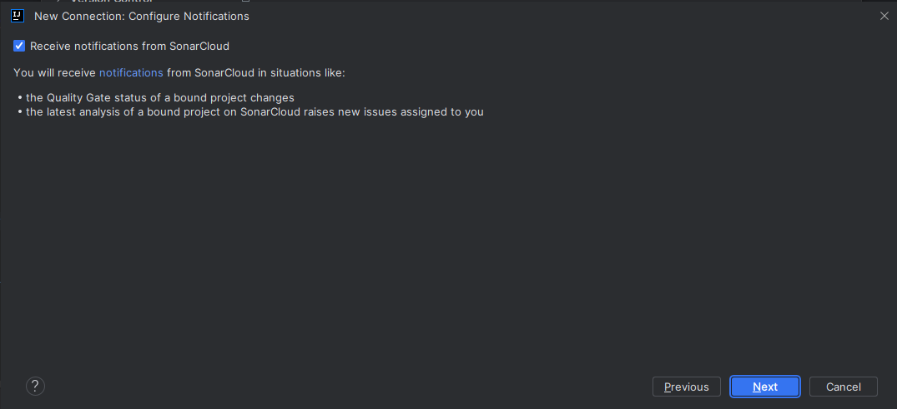
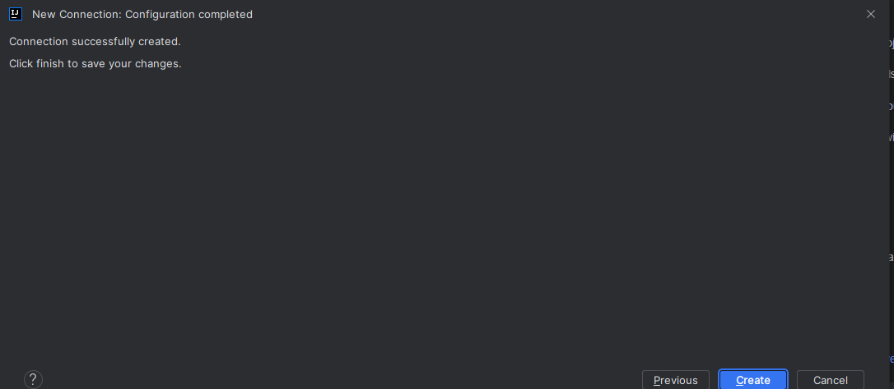
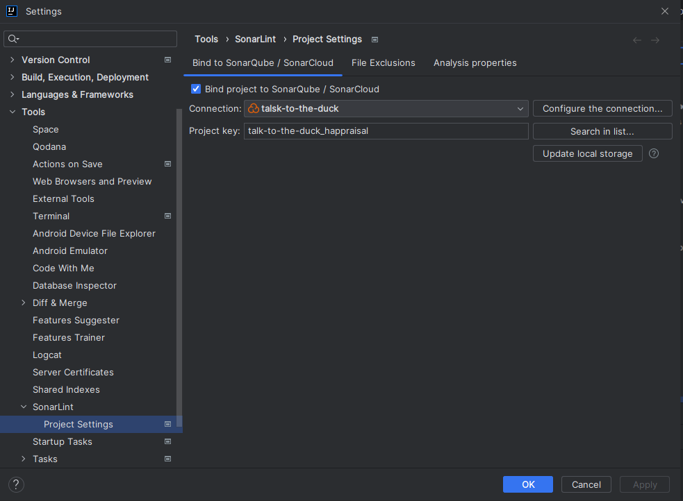
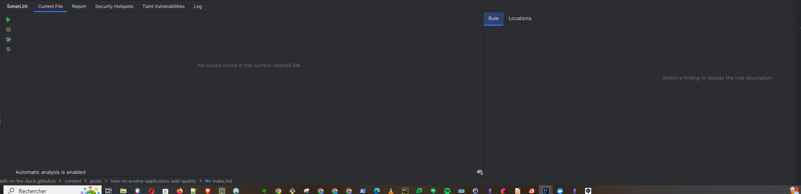

+++
title = "How to evolve an application to make it more robust and maintainable - Add a tool to assess code quality"
description = ""
date = 2023-05-29
featured = false
draft = false
comment = true
toc = true
reward = true
pinned = false
categories = [
"quality", "test", "CICD", "Sonarqube", "Owasp", "Gradle"
]
tags = [
""
]
series = [
"How to evolve an application to make it more robust and maintainable"
]
images = []
+++

<!--more-->


## Foreword

In the previous articles of this series we looked at how to add tests and how to run them automatically via the CI/CD; we configured in GitHub Actions.
In this article we'll continue to improve the quality of our project using Sonarqube.


## What are Sonarcloud and Sonarqube
More information could be found in this [post](../howto/how-to-use-sonarcloud/)


## Integration in Java project with Gradle

### Declare  plugin
* Add plugin

````groovy 
plugins {
    id("org.sonarqube") version "4.1.0.3113"
}

````
* Add configuration 
````groovy
sonar {
    properties {
        property "sonar.projectkey", "happraisal"
        property "sonar.projectName", "happraisal"
        property "sonar.host.url", "http://localhost:9000"
        property "sonar.coverage.jacoco.xmlReportPaths", "build/reports/jacoco/all-tests/jacocoAllTestReport.xml"
        property "sonar.sources", "src/main,build.gradle,gradle"
        property "sonar.tests", "src/test,src/integration-test,src/system-test"
        property "sonar.junit.reportPaths", "build/test-results/test,build/test-results/integrationTest,build/test-results/systemTest"
    }
}
````

#### Export results

From IntelliJ, via configuration or terminal you can execute:
```` 
clean build jacocoTestReport sonar -Dsonar.login=<<YOUR_ID>> -Dsonar.password=<<YOU_PASSWORD>>

````

If you have created a token you can run 


````
./gradlew clean build jacocoTestReport sonar -Dsonar.login=<<TOUR_TOKEN>>

````

### Multi module

In multi-module projects each module must execute its own sonar task.


## Tools around Sonar
### Sonar API

Sonar provides some APIs to manage projecst, quality profiles, quality gates and other.

You can find more details [here](https://next.sonarqube.com/sonarqube/web_api/) .
Before you can call these APIs, you have to create a token. You can use http capable tools such as Postman or curl.

To create a token, login to the SonarQube or SonarCloud web user interface and go to your profile, then go to the security tab and create a token.

For some APIs such as
* /api/qualitygates/select
* /api/projects/search

 you have to create a token with administrator authorizations.


### SonarLint
SonarLint is a tool that can be used to analyze source code.

#### Configuration 
* Add a SonarLint plugin to IntelliJ
* Open the SonarLint settings in Tools/SonarLint menu

 

* Choose a connection type, for this article we chose SonarCloud.


* Click on _the online service_ link to connect to Sonarcloud service



* Set the token or, if you don't have one yet, create one from the link [here](https://sonarcloud.io/account/security)



* Select your organization



* Check the _Receive notifications from SonarCloud_ option



* Approve the creation 



* Bind the project with the connection



####  How to use SonarLint
In IntelliJ there is a SonarLint window


In this window: 

* From the _Current File_ tab, you can analyze the file selected and displayed in IntelliJ
* From the _Report_ tab, you can analyse just the changed files or all the files in the project.


If you have any remarks on the content or the form, you can leave a comment…it is by exchanging that we progress.

Author : Emmanuel Quinton
Reviewer : Daniele Cremonini