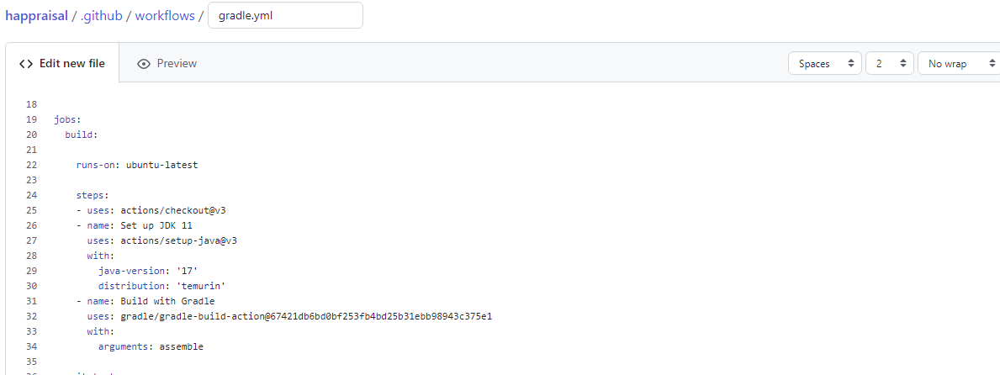

+++
title = "Comment faire évoluer une application pour la rendre plus robuste et maintenable - Mise en place du CICD"
description = ""
date = 2023-01-15
featured = false
draft = false
comment = true
toc = true
reward = true
pinned = false
categories = [
"qualité", "test", "CICD"
]
tags = [
""
]
series = [
" Comment faire évoluer une application pour la rendre plus robuste et maintenable"
]
images = []
+++

<!--more-->


## Préambule

Dans le dernier article, nous avons décrit les tests ajoutés à notre projet.
Ces tests sont utiles pour vérifier notre développement localement puisque nous utilisons le TDD. Mais ils sont aussi utiles pour vérifier s'il y a des régressions.
Dans cet article, nous allons

* Définir ce qu'est le CICD.
* Montrer comment ajouter les paramètres CICD à notre projet.

## Qu'est-ce que le CICD ?

L'acronyme CICD signifie Continuous Integration Continuous  (intégration continue, livraison continue.
L'acronyme CICDCD signifie Continuous Integration Continuous Delivery Continuous Deployment (intégration continue, livraison continue, déploiement continu).

Lorsque nous parlons de CICD (ou CICDCD), nous faisons souvent référence aux pipelines.
Un pipeline CICD définit un processus dans lequel certaines étapes sont exécutées l'une après l'autre, dans le but de construire et de vérifier l'application avant de la livrer et de la déployer.


## Quels outils CICD ?

Il existe quelques outils pour exécuter le CICD ; nous pouvons citer :
* Gitlab-ci
* CircleCI
* GitHub Action
* Jenkins

Pour les projets open source comme le nôtre, il est plus facile d'utiliser un outil de CICD intégré dans un service d'hébergement et de gestion de développement logiciel comme GitLab ou GitHub.
C'est pourquoi nous préférons utiliser GitLab, CircleCi ou GitHub Actions.
car Jenkins nécessite un déploiement, une gestion et des ressources matérielles distincts.

Nous souhaitons également utiliser un service gratuit, c'est pourquoi nous n'utilisons pas de CI Gitlab ; car nous ne pouvons plus pousser le rapport de Gitlab vers Github avec l'offre gratuite.

Dans ce billet, nous allons détailler ces solutions mais nous n'en implémenterons que deux :

* CircleCI
* Action GitHub


## Mise en place de notre CICD


### Notre pipeline souhaité

A travers notre premier pipeline, nous voulons valider :

* construire l'application.
* vérifier que le code est formaté.
* vérifier la non-régression du code par l'exécution de tests.


Nous voulons également que le pipeline soit exécuté à chaque commit sur la branche _develop_ et les branches CI (avec le préfixe ci_).
Nous pourrions ajouter d'autres types de branches : feature(feat/), fix (fix/), documentation (docs/)

### Implémentation avec CircleCI

#### Première connexion

CircleCI est une plateforme de CICD qui a un plan gratuit ;
Pour pouvoir utiliser CircleCI, nous devons :
* Créer un compte

  

* Configurer notre code

  

* Configurer

Il y a trois possibilités pour lier votre projet avec votre futur CI :


#### Création d'un job

CircleCI définit des "jobs" qui sont des tâches exécutables ; chaque job peut être divisé en étapes
Dans la première version de notre CI (cf. code ci-dessous) nous voulons :
* construire le fichier jar.
* Exécuter les tests unitaires.
* Exécuter les tests d'intégration.
* Exécuter les tests système.


````
# Java Gradle CircleCI 2.0 configuration file
# See: https://circleci.com/docs/2.0/language-java/
version: 2.1


# Define a job to be invoked later in a workflow.
# See: https://circleci.com/docs/2.0/configuration-reference/#jobs
jobs:
assemble:
# Specify the execution environment. You can specify an image from Dockerhub or use one of our Convenience Images from CircleCI's Developer Hub.
# See: https://circleci.com/docs/2.0/configuration-reference/#docker-machine-macos-windows-executor
docker:
# specify the version you desire here
- image: cimg/openjdk:17.0.5

      # Specify service dependencies here if necessary
      # CircleCI maintains a library of pre-built images
      # documented at https://circleci.com/docs/2.0/circleci-images/
      # - image: circleci/postgres:9.4

    working_directory: ~/happraisal

    environment:
      # Customize the JVM maximum heap limit
      JVM_OPTS: -Xmx3200m
      TERM: dumb
    # Add steps to the job
    # See: https://circleci.com/docs/2.0/configuration-reference/#steps
    steps:
      - checkout
      - attach_workspace:
          at: ~/happraisal

      # Download and cache dependencies
      - restore_cache:
          keys:
            - v1-dependencies-{{ checksum "build.gradle" }}
            # fallback to using the latest cache if no exact match is found
            - v1-dependencies-

      - run: ./gradlew assemble

      - save_cache:
          paths:
            - ~/.gradle
          key: v1-dependencies-{{ checksum "build.gradle" }}
      - persist_to_workspace:
          root: ~/happraisal
          paths:
            - ./build
      - store_artifacts:
          path: ~/happraisal/build/libs

unit-tests:
docker:
- image: cimg/openjdk:17.0.5

    working_directory: ~/happraisal
    steps:
        - checkout
        - restore_cache:
            keys:
              - v1-dependencies-{{ checksum "build.gradle" }}
              # fallback to using the latest cache if no exact match is found
              - v1-dependencies-
        - run: ./gradlew test
        - save_cache:
            paths:
              - ~/.gradle
            key: v1-dependencies-{{ checksum "build.gradle" }}
        - store_test_results:
            path:  ~/happraisal/build/test-results


integration-tests:
docker:
- image: cimg/openjdk:17.0.5

    working_directory: ~/happraisal
    steps:
        - checkout
        - restore_cache:
            keys:
              - v1-dependencies-{{ checksum "build.gradle" }}
              # fallback to using the latest cache if no exact match is found
              - v1-dependencies-
        - run: ./gradlew integrationTest
        - save_cache:
            paths:
              - ~/.gradle
            key: v1-dependencies-{{ checksum "build.gradle" }}


system-tests:
docker:
- image: cimg/openjdk:17.0.5

    working_directory: ~/happraisal
    steps:
        - checkout
        - restore_cache:
            keys:
              - v1-dependencies-{{ checksum "build.gradle" }}
              # fallback to using the latest cache if no exact match is found
              - v1-dependencies-
        - run: ./gradlew systemTest
        - save_cache:
            paths:
              - ~/.gradle
            key: v1-dependencies-{{ checksum "build.gradle" }}

workflows:
version: 2.1
microservice:
jobs:
- assemble
- unit-tests:
requires:
- assemble
- integration-tests:
requires:
- assemble
- system-tests:
requires:
- assemble

````


### Mise en oeuvre avec les actions GitHub

#### Terminologie

Un flux de travail : Dans la documentation officielle, un workflow est défini comme "un processus automatisé configurable qui exécutera un ou plusieurs travaux".
Il est configuré via un fichier yaml. cf. https://docs.github.com/fr/actions/using-workflows/about-workflows

Action : "Les actions sont des tâches individuelles que vous pouvez combiner pour créer des tâches et personnaliser votre flux de travail." cf. https://docs.github.com/fr/actions/creating-actions/about-custom-actions

#### Première connexion

GitHub Actions est l'outil de CI de GitHUb.
Ce CI est accessible depuis le bouton Action dans une barre d'outils


Lors du premier accès, GithUb Actions affiche une proposition de workflow en fonction de votre projet.
Dans notre cas, nous avons sélectionné le workflow java avec gradle.


Une fois que nous avons sélectionné notre workflow, nous sommes redirigés vers l'éditeur nous proposant un fichier par défaut.
Il est possible de le modifier et de le sauvegarder sur une branche spécifique ; afin de tester facilement le CICD sans avoir à le pousser sur develop.
Il est possible de définir le nom de la branche de travail dans la partie push.



### Création de jobs


````yml
on :
  push :
    branches :
    - develop
    - ci_* 
````


Pour mettre en oeuvre les 3 étapes définies ci-dessus, nous devons créer les jobs :

* assemble : pour compiler le code et créer le jar.
* spotless : pour vérifier le format du nouveau code.
* unit-tests : pour exécuter les tests unitaires.
* integration-tests : pour exécuter les tests d'intégration.
* system-tests : pour exécuter les tests système.

Le code ci-dessous montre un exemple de création d'un job


````yml
jobs:
  assemble:
    runs-on: ubuntu-latest
    steps:
    - uses: actions/checkout@v3
    - uses: actions/setup-java@v3
      with:
        java-version: '17'
        distribution: 'temurin'
        cache: gradle
    - run: ./gradlew assemble --no-daemon

````


Dans le code ci-dessus :

* nous créons le job assemble qui est basé sur ubuntu-latest
* Nous utilisons deux actions pour vérifier le code et configurer le compilateur Java.
* Nous exécutons la tâche gradle assemble.


## Résumé
Le premier objectif de cet article était de tester trois moteurs CICD (GitLab, CircleCi et GitHub Actions), mettant en oeuvre des pipelines similaires.
En essayant d'implémenter le CICD sur ces moteurs, nous avons rapidement rencontré quelques limitations pour les deux premiers CICD :

* Pousser le rapport de la CI Gitlab vers GitHub n'est pas possible.
* Sur CircleCi, l'espace maximum disponible pour les artefacts et leur temps de rétention n'étaient pas compatibles avec nos objectifs.
  https://app.circleci.com/settings/plan/github/talk-to-the-duck/overview?return-to=https%3A%2F%2Fapp.circleci.com%2Fprojects%2Fproject-dashboard%2Fgithub%2Ftalk-to-the-duck%2F
  Dans ce cas, seule l'action GitHub est complètement utile.


En conclusion, je pense que pour mettre en place un CICD libre, il est préférable d'utiliser un CI intégré à son gestionnaire de version comme GItHub Actions pour GitHub ou GitLab CICD pour GitLab.


Si vous avez des remarques sur le fond ou la forme, vous pouvez laisser un commentaire...c'est en échangeant que l'on progresse.

Traduit avec www.DeepL.com/Translator (version gratuite)