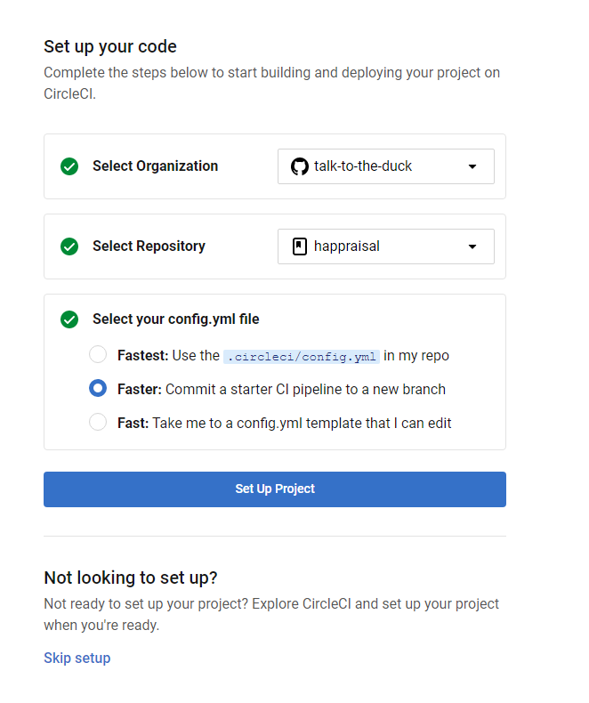
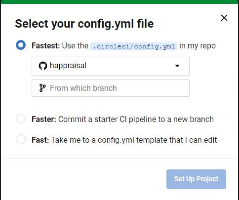

+++
title = "How to evolve an application to make it more robust and maintainable - Setting up the CICD"
description = ""
date = 2023-01-15
featured = false
draft = false
comment = true
toc = true
reward = true
pinned = false
categories = [
"quality", "test", "CICD"
]
tags = [
""
]
series = [
" How to evolve an application to make it more robust and maintainable"
]
images = []
+++

<!--more-->


## Foreword

In the last article we described the tests added to our project. 
These tests are useful to check our development locally as we use TDD. But they are also useful to check if there are regressions.
In this post we will: 

* define what the CICD is
* How to add the CICD settings to our project

## What is the CICD

The acronym CICD stands for Continuous Integration Continuous Delivery.
The acronym CICDCD stands for Continuous Integration Continuous Delivery Continuous Deployment

When we talk about CICD (or CICDCD) we often also refer to the pipelines.
A CICD pipeline defines a process where certain steps are executed one after the other, all with the aim of building, and verifying the application before delivering it and deploying it.


## What CICD tools

There are some tools to execute CICD; we can quote:
* Gitlab-ci
* CircleCI
* GitHub Action
* Jenkins

For open sources projects as our, it's easier to use a CICD tool integrated into a web hosting and software development management service such as GitLab or GitHub.
It's why we prefer to use GitLab, CircleCi or GitHub Actions
tools as Jenkins need a separate deployment, management and hardware resources.

We also want to use a free service, it is why we don't use a Gitlab CI; because we can't no longer push the report from Gitlab to Github withe the free plan.

In this post we will detail these solutions but we will implement only two of them: 

* CircleCI
* GitHub Action


## Implementation of our CICD


### Our desired pipeline

Through our first pipeline we want to validate :

* build the application
* check if the code is formatted
* verify the non-regression of the code through the execution of test


Also we want the pipeline to be run on every commit to the develop branch and the ci branches (with prefix ci_).
We could add other kind of branches: feature(feat_), fixes (fix_), documentation (doc_)

### Implementation with CircleCI

#### First connection

CircleCI is a CICD platform which has a free plan; 
To be able to use CircleCI we need to: 
* Create an account

  

* Set up our code

  

* Configure

There are tree possibilities to link your project with your future CI:




#### Creation of a job

CircleCI defines "jobs" which are executables tasks; each job can  be divided into steps
In the first version of our CI (cf. code below) we want to:
* build the jar file
* run the unit tests
* run the integration tests
* run the system test


````
# Java Gradle CircleCI 2.0 configuration file
# See: https://circleci.com/docs/2.0/language-java/
version: 2.1


# Define a job to be invoked later in a workflow.
# See: https://circleci.com/docs/2.0/configuration-reference/#jobs
jobs:
assemble:
# Specify the execution environment. You can specify an image from Dockerhub or use one of our Convenience Images from CircleCI's Developer Hub.
# See: https://circleci.com/docs/2.0/configuration-reference/#docker-machine-macos-windows-executor
docker:
# specify the version you desire here
- image: cimg/openjdk:17.0.5

      # Specify service dependencies here if necessary
      # CircleCI maintains a library of pre-built images
      # documented at https://circleci.com/docs/2.0/circleci-images/
      # - image: circleci/postgres:9.4

    working_directory: ~/happraisal

    environment:
      # Customize the JVM maximum heap limit
      JVM_OPTS: -Xmx3200m
      TERM: dumb
    # Add steps to the job
    # See: https://circleci.com/docs/2.0/configuration-reference/#steps
    steps:
      - checkout
      - attach_workspace:
          at: ~/happraisal

      # Download and cache dependencies
      - restore_cache:
          keys:
            - v1-dependencies-{{ checksum "build.gradle" }}
            # fallback to using the latest cache if no exact match is found
            - v1-dependencies-

      - run: ./gradlew assemble

      - save_cache:
          paths:
            - ~/.gradle
          key: v1-dependencies-{{ checksum "build.gradle" }}
      - persist_to_workspace:
          root: ~/happraisal
          paths:
            - ./build
      - store_artifacts:
          path: ~/happraisal/build/libs

unit-tests:
docker:
- image: cimg/openjdk:17.0.5

    working_directory: ~/happraisal
    steps:
        - checkout
        - restore_cache:
            keys:
              - v1-dependencies-{{ checksum "build.gradle" }}
              # fallback to using the latest cache if no exact match is found
              - v1-dependencies-
        - run: ./gradlew test
        - save_cache:
            paths:
              - ~/.gradle
            key: v1-dependencies-{{ checksum "build.gradle" }}
        - store_test_results:
            path:  ~/happraisal/build/test-results


integration-tests:
docker:
- image: cimg/openjdk:17.0.5

    working_directory: ~/happraisal
    steps:
        - checkout
        - restore_cache:
            keys:
              - v1-dependencies-{{ checksum "build.gradle" }}
              # fallback to using the latest cache if no exact match is found
              - v1-dependencies-
        - run: ./gradlew integrationTest
        - save_cache:
            paths:
              - ~/.gradle
            key: v1-dependencies-{{ checksum "build.gradle" }}


system-tests:
docker:
- image: cimg/openjdk:17.0.5

    working_directory: ~/happraisal
    steps:
        - checkout
        - restore_cache:
            keys:
              - v1-dependencies-{{ checksum "build.gradle" }}
              # fallback to using the latest cache if no exact match is found
              - v1-dependencies-
        - run: ./gradlew systemTest
        - save_cache:
            paths:
              - ~/.gradle
            key: v1-dependencies-{{ checksum "build.gradle" }}

workflows:
version: 2.1
microservice:
jobs:
- assemble
- unit-tests:
requires:
- assemble
- integration-tests:
requires:
- assemble
- system-tests:
requires:
- assemble

````


### Implementation with GitHub Actions

#### Terminology

A Workflow: In the official documentation a workflow is defined as  "a configurable automated process that will execute one or more jobs.
It is set up via a yaml file. cf. https://docs.github.com/fr/actions/using-workflows/about-workflows

Action: "Actions are individual tasks that you can combine to create jobs and customize your workflow." cf. https://docs.github.com/fr/actions/creating-actions/about-custom-actions

####  First connection

GitHub Actions is the CI tool of GitHUb.
This CI is accessible from the Action button in a toolbar


During the first access, GithUb Actions displays a workflow proposal according to your project.
In our case we have selected the java with gradle workflow.


Once we have selected our workflow, we are redirected to the editor proposing us a default file.
It is possible to modify it and save it on a specific branch; In order to easily test the CICD without having to push on develop.
It is possible to define the name of the working branch in the part push.


### Creation of jobs


````yml
on:
  push:
    branches:
    - develop
    - ci_* 
````


To implement the 3 steps defined above, we need to create the jobs:

* assemble: to compile the code and create the jar.
* spotless: to check the format of new code.
* unit-tests: to execute the unit tests.
* integration-tests: to execute the integration tests.
* system-tests: to execute the system tests.

the code below shows an exemple of how to create a job


````yml
jobs:
  assemble:
    runs-on: ubuntu-latest
    steps:
    - uses: actions/checkout@v3
    - uses: actions/setup-java@v3
      with:
        java-version: '17'
        distribution: 'temurin'
        cache: gradle
    - run: ./gradlew assemble --no-daemon

````


In the code above:

* we create the assemble job which is based on ubuntu-latest
* we use two actions to check the code and configure the Java compiler.
* we run the gradle assemble job.


## Summary
The first objective of this article was to test three cicd engines (GitLab, CircleCi and GitHub Actions), implementing similar pipelines.
While trying to implement the cicd on these engines, we quickly encountered some limitations for the first two CICD:

* pushing the report of the Gitlab CI to GitHub is not possible.
* on CircleCi maximum available space for the artefacts and their retention time were not compatible with our objectives.
  https://app.circleci.com/settings/plan/github/talk-to-the-duck/overview?return-to=https%3A%2F%2Fapp.circleci.com%2Fprojects%2Fproject-dashboard%2Fgithub%2Ftalk-to-the-duck%2F
In this case, only the GitHub action is completely useful.


As a conclusion I think that to set up a free CICD, it is preferable to use a CI integrated with its version manager such as GItHub Actions for GitHub or GitLab CICD for GitLab.


If you have any remarks on the content or the form, you can leave a comment…it is by exchanging that we progress.

