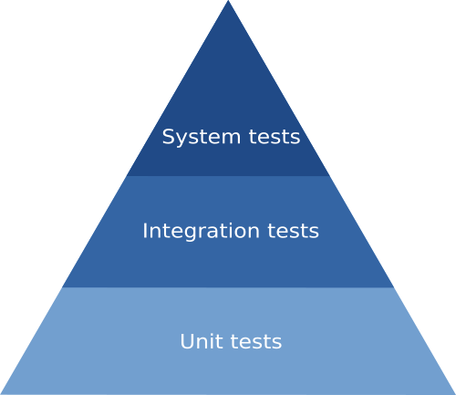
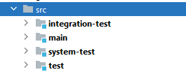

+++
title = "Comment faire évoluer une application pour la rendre plus robuste et maintenable - Mise en place de tests"
description = ""
date = 2022-02-21T08:10:45+01:00
featured = false
draft = false
comment = true
toc = true
reward = true
pinned = false
categories = [
"qualité", "test"
]
tags = [
  ""
]
series = [
"Comment faire évoluer une application pour la rendre plus robuste et maintenable"
]
images = []
+++

<!--more-->


# Série Comment faire évoluer une application - Mise en place des Tests

## Préambule
Dans l’article d’introduction de cette série (lien) nous avons présenté les différents problèmes de notre application (ajouter le lien). Le premier que je vous propose de résoudre dans cet article est l’ajout de tests. \
Cet ajout de tests n’a pas pour unique but de couvrir du code et faire passer une quality gate ; il est là pour valider les règles métier et permettre une refactorisation avec moins de risques.
Dans cet article, nous verrons comment ajouter des tests à une application qui n’en a pas.
On abordera les tests unitaires, les tests d’intégrations et les tests de systèmes.


## Définitions des différents types de tests
Un test unitaire est un test qui ne vérifie que la méthode d’une classe ou une classe. Les classes externes, souvent appelées “collaborateurs”, qui pourraient être appelées seront mockées. Nous placerons des tests unitaires essentiellement sur les services qui doivent contenir le code métier, c'est-à-dire le code avec de la valeur ajoutée.
Un test d’intégration est un test qui à pour objectif de vérifier la bonne intégration de certaines parties d’un traitement et non celui-ci dans son ensemble. On concentrera nos tests d’intégration sur les endpoints et les repositories.
Un test système est un test en boite noir qui va vérifier que l’ensemble du cas d'utilisation fonctionne.



Dans un cas comme celui de notre application, où aucun test n’existe, il est préférable de partir sur un test système pour vérifier rapidement le bon fonctionnement et la non-régression d’une fonctionnalité puis par la suite d’augmenter les tests unitaires et les tests d’intégration.


## Tests unitaires
Notre application étant en java, nous utiliserons comme librairies pour les tests :
Junit5, Mockito et AssertJ.


### Paramétrage du test
Les dépendances sont à ajouter dans le build.gradle mais pour des raisons de lisibilité, je préfère créer un fichier unit-test.gradle qui contiendra toutes les configurations nécessaires.
Ce fichier est appelé par le fichier build.gradle

**Emplacement du fichier unit-test.gradle**


**Contenu du fichier unit-test.gradle**
``` groovy
dependencies {

   testImplementation group: 'org.junit.jupiter', name: 'junit-jupiter', version: '5.8.2'
   testImplementation group: 'org.mockito', name: 'mockito-junit-jupiter', version: '4.2.0'
   testImplementation group: 'org.assertj', name: 'assertj-core', version: '3.21.0'
   testImplementation group: 'org.mockito', name: 'mockito-core', version: '4.2.0'
}

```


**Dans le fichier build.gradle**
``` groovy
apply from: "gradle/unit-test.gradle"
```


### Mise en place d’un test
Les règles pour écrire un test unitaire :
* Chaque test doit être créé dans le répertoire test
* Chaque classe de test se trouve dans le même package que la classe qu’il teste
* Le nom des méthodes de tests sont en snack_case (cf [https://en.wikipedia.org/wiki/Snake_case](https://en.wikipedia.org/wiki/Snake_case))
* Le nombre de choses testées doit être limité, idéalement à 1.


### Exemple de test
``` java

@Test
void should_add_question_to_form() {
 // given
 var formId = UUID.fromString("18b8f2e2-f41c-4ca4-a007-c328390cd099");
 var savedForm = new Form();
 var existingQuestion = new QuestionAnswer(formId, "What is your first name", null, savedForm);
 var questions = new HashSet<QuestionAnswer>();
 questions.add(existingQuestion);
 savedForm.setQuestions(questions);
 savedForm.setId(formId);

 BDDMockito.when(formRepository.getById(formId)).thenReturn(savedForm);

 var questionToSave =
     new QuestionAnswer(null, "What is your objectives for the next year", null, null);

 // when
 formService.createQuestion(formId, questionToSave);

 // then
 var questionAnswerArgumentCaptor = ArgumentCaptor.forClass(QuestionAnswer.class);

 BDDMockito.then(questionAnswerRepository).should().save(questionAnswerArgumentCaptor.capture());
 var actualQuestions = questionAnswerArgumentCaptor.getValue();
 BDDSoftAssertions.thenSoftly(
     softly -> {
       softly.then(actualQuestions).isNotNull();
       softly.then(actualQuestions)
               .extracting("form.questions", Assertions.as(InstanceOfAssertFactories.COLLECTION))
               .hasSize(2);
     });
}

```


### Détail du code
Les points les plus importants sont :
* L'utilisation de mock pour simuler le comportement des méthodes d’autre classes qui sont appelées

``` java
BDDMockito.when(formRepository.getById(formId)).thenReturn(savedForm);

```

* L’utilisation d’ArgumentCaptor pour choper et ensuite valider le formulaire passé à la méthode save du repository

``` java
 var questionAnswerArgumentCaptor = ArgumentCaptor.forClass(QuestionAnswer.class);

 BDDMockito.then(questionAnswerRepository).should().save(questionAnswerArgumentCaptor.capture());
     var actualQuestions = questionAnswerArgumentCaptor.getValue();

```

* L’utilisation de SoftAssertions pour pouvoir vérifier plusieurs choses. Contrairement à une validation via la classe Assertions qui va lever une erreur à la première erreur, SoftAssertions va tester toutes les conditions et remonter les erreurs par la suite.

``` java
 BDDSoftAssertions.thenSoftly(
     softly -> {
       softly.then(actualQuestions).isNotNull();
       softly.then(actualQuestions)
               .extracting("form.questions", Assertions.as(InstanceOfAssertFactories.COLLECTION))
               .hasSize(2);
     });
```


## Tests d’intégrations
### Paramétrage du test

Pour la mise en place des tests d’intégration, nous allons créer un répertoire au même niveau que les répertoires test et main.


La séparation des tests unitaires et des tests d’intégration a l’avantage de nous permettre de distinguer quel type de tests on souhaite exécuter et quand cela aura son utilité lors de la mise en place de la CI/CD
La configuration se fera comme dans les tests unitaires via un fichier gradle séparé.

**Emplacement du fichier integration-test.gradle**


**Contenu du fichier integration-test.gradle**
``` groovy
sourceSets {
    integrationTest {
        java {
            compileClasspath += sourceSets.main.output
            runtimeClasspath += sourceSets.main.output
            srcDir file('src/integration-test/java')
        }
        resources.srcDir file('src/integration-test/resources')
    }
}

configurations {
    integrationTestImplementation.extendsFrom implementation
    integrationTestRuntimeOnly.extendsFrom runtimeOnly
}

dependencies {
    integrationTestImplementation group: 'org.springframework.boot', name: 'spring-boot-starter-test'
    integrationTestImplementation group: 'org.mockito', name: 'mockito-core', version: '4.2.0'
    integrationTestImplementation group: 'org.mockito', name: 'mockito-inline', version: '4.2.0'
}

tasks.register('integrationTest', Test) {
    description = 'Runs integration tests.'
    group = 'verification'

    testClassesDirs = sourceSets.integrationTest.output.classesDirs
    classpath = sourceSets.integrationTest.runtimeClasspath
    shouldRunAfter test
    useJUnitPlatform()
}

check.dependsOn integrationTest
```

**Dans le fichier build.gradle**

``` groovy
apply from: "gradle/unit-test.gradle"
apply from: "gradle/integration-test.gradle"

```


### Mise en place d’un test
La durée des tests d’intégrations étant plus longs, on va les limiter aux controllers et aux repositories ; les services, ont l’a vu plus haut, sont testés par des tests unitaires.
Au niveau des controllers on aura pour objectifs de vérifier que les endpoints répondent correctement, c'est-à-dire qu’on vérifiera :
* la validité du statut retourné.
* la remontée d’erreur suite à une invalidité des paramètres ou dans le corp de la requête

Les services appelés dans les controllers seront mockés, les appels aux méthodes des services pourront être validés.
Cette façon de tester nous fait comprendre pourquoi il faut limiter le code métier dans les controllers.
Au niveau des repositories nous vérifierons la validité des requêtes, on se concentrera dans un premier temps sur les requêtes les plus complexes.


**Exemple de test d'intégration d’un controller**
``` java
@WebMvcTest(controllers = InterviewController.class)
public class InterviewControllerITest {

 @Autowired Jackson2ObjectMapperBuilder mapperBuilder;

 @Autowired private MockMvc mockMvc;

 @MockBean private InterviewService interviewService;

 @Test
 @DisplayName("Should get all interviews")
 void should_get_persons() throws Exception {
   // when
   mockMvc
       .perform(
           MockMvcRequestBuilders.get("/interviews")
               .contentType(MediaType.APPLICATION_JSON)
               .accept(MediaType.APPLICATION_JSON))
       .andExpect(MockMvcResultMatchers.status().isOk());

   // then
   BDDMockito.then(interviewService).should().findAll();
 }


```


**Exemple de test d'intégration d’un repository**
``` java

@DataJpaTest
@ActiveProfiles("it")
public class FormRepositoryITest {
   @Autowired
   private FormRepository formRepository;

   @Test
   void should_create_form() {
       // given
       var questionAnswer = new QuestionAnswer(null, "What do you think about your work this year", null, null);
       var formToSave = new Form(null, Set.of(questionAnswer));

       // when
       var actualForm = formRepository.save(formToSave);

       // then
       var idNotNull = new Condition<Form>((Form form) -> form.getId() != null, "form id not null");
       var asOneQuestion = new Condition<Form>((Form form) -> form.getQuestions().size() == 1, "form has only one question");
       BDDAssertions.then(actualForm)
               .as("Check if a new form has been saved.")
               .has(idNotNull)
               .has(asOneQuestion);
   }


```


### Détail du code
#### Test des endpoints
Pour les tests des endpoints on annote les classes tests avec [@WebMvcTest](https://docs.spring.io/spring-boot/docs/current/api/org/springframework/boot/test/autoconfigure/web/servlet/WebMvcTest.html), qui permet de charger un environnement minimal afin de pouvoir tester uniquement le controller défini dans l’annotation.
``` java
@WebMvcTest(controllers = InterviewController.class)
```


La classe MockMvc de spring permet de tester les endpoint sans pour autant charger tout le contexte de l’application.
``` java
   mockMvc
       .perform(
           MockMvcRequestBuilders.get("/interviews")
               .contentType(MediaType.APPLICATION_JSON)
               .accept(MediaType.APPLICATION_JSON))
       .andExpect(MockMvcResultMatchers.status().isOk());
```


Afin de tester uniquement l'endpoint (code retour, objet retourné …) on mock le service qui est appelé avec l’annotation @MockBean de spring
``` java
 @MockBean private InterviewService interviewService;
```


#### Test des repositories
Les tests d'intégration entre un repository et la bases de données se fait avec l’annotation `@DataJpaTest `
Lors d’un test d’enregistrement d’un objet, il est possible de vérifier l’identifiant généré de l’objet en retour
Pour des méthodes de type find, findAll, findId nous pouvons utiliser l'annotation @Sql afin de peupler la base de données avant de faire le test. Ceci se révèle utile lorsque la base de données au démarrage est vide. Ici je ne l’ai pas fait, mais il est tout à fait possible de démarrer les tests avec une base de données pré-initialisée.

``` java
@Sql(scripts = {"/sql_scripts/initialize_form.sql"} )
```


## Tests system
### Paramétrage du test
Tout comme pour les tests d’intégration les tests system sont dans un répertoire distinct ; La configuration se trouve dans le fichier system-test.gradle




**Emplacement du fichier system-test.gradle**


**Contenu du fichiersystem-test.gradle**
``` groovy
sourceSets {
   systemTest {
       java {
           compileClasspath += sourceSets.main.output
           runtimeClasspath += sourceSets.main.output
           srcDir file('src/system-test/java')
       }
       resources.srcDir file('src/system-test/resources')
   }
}

configurations {
   systemTestImplementation.extendsFrom implementation
   systemTestRuntimeOnly.extendsFrom runtimeOnly
}

dependencies {
   systemTestImplementation group: 'org.springframework.boot', name: 'spring-boot-starter-test'
   systemTestImplementation group: 'io.rest-assured', name: 'rest-assured', version: '4.4.0'
   systemTestImplementation group: 'org.mockito', name: 'mockito-core', version: '4.2.0'
   systemTestImplementation group: 'org.mockito', name: 'mockito-inline', version: '4.2.0'


}

```


**Dans le fichier build.gradle**
``` groovy

apply from: "gradle/unit-test.gradle"
apply from: "gradle/integration-test.gradle"
apply from: "gradle/system-test.gradle"

systemTest {
  shouldRunAfter integrationTest
}

```


### Mise en place d’un test
```  java

@SpringBootTest(webEnvironment = SpringBootTest.WebEnvironment.RANDOM_PORT)
class PostInterviewTest {
 @Autowired Jackson2ObjectMapperBuilder mapperBuilder;

 @LocalServerPort

 private Integer port;

 @BeforeAll
 public static void setup() {
   RestAssured.baseURI = "http://localhost";
 }
 @Test
 @Sql(scripts = "/sql_scripts/init_database.sql")
 void should_create_interview() throws JsonProcessingException {
   var manager =
       new Person(UUID.fromString("8a37adbc-0c29-491a-8b6f-f10a4219fb91"), null, null, true);
   var employee =
       new Person(UUID.fromString("3556c835-3bcd-420e-bb6e-a8b7c0bb139d"), null, null, false);
   var form = new Form(UUID.fromString("df9b2aad-d32e-469e-b434-be71a5531a35"), new HashSet<>());
   var interview = new Interview(null, Instant.now(), manager, employee, form);

   RestAssured.given()
           .header("Content-type", "application/json")
           .and()
           .port(port)
       .body(mapperBuilder.build().writeValueAsString(interview))
       .when()
           .post("/interviews")
       .then()
           .statusCode(HttpStatus.SC_CREATED);
 }
}

```

### Détails du code
Les points à noter dans ce test sont :
* L’utilisation de l’annotation SpringBootTest qui permet de charger l’ensemble du contexte spring.
* L’utilisation de RestAssured pour tester les endpoints.


## Résumé
* Il existe trois types de bases de tests : les tests unitaires qui testent une méthode et uniquement le contenu de la méthode, les tests d’intégration qui valident la bonne intégration entre deux couches (appel des endpoints, connexion repository / base de données) et enfin les tests systèmes qui permettent de valider le bon fonctionnement d’une fonctionnalité
* Pour une API existante et dépourvue de tests, il est possible de commencer par la mise en place de tests système sur les endpoints les plus critiques puis d’ajouter progressivement des tests d’intégration et des tests unitaires.
* Pour une nouvelle API il est préférable de commencer par des tests unitaires et de progresser vers les tests systèmes

Si vous avez des remarques sur le contenu, la forme vous pouvez laisser un commentaire… c’est en échangeant qu’on progresse.

Écrit par : Emmanuel Quinton
Revue par : Daniele Cremonini
