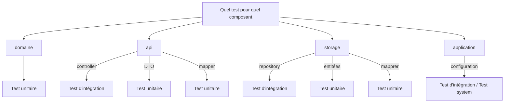
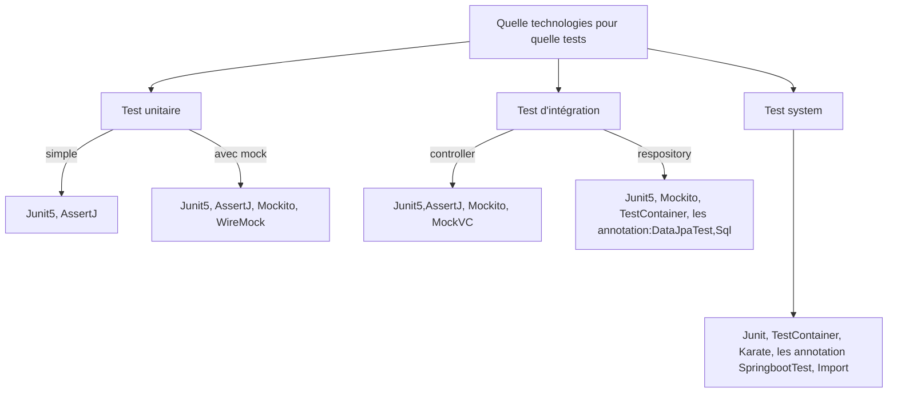

+++
title = "How to test a java springboot application"
description = ""
date = 2023-09-09
featured = false
draft = false
comment = true
toc = true
reward = true
pinned = false
categories = [
"quality", "test", "Sprinboot", "Junit", "Mockito"
]
tags = [
""
]
series = [
" How to evolve an application to make it more robust and maintainable"
]
images = []
+++
{{ if .Page.Store.Get "hasMermaid" }}
  
{{ end }}

## Foreword

L'objectif de ce post est de définir :
- Quel type de test faire en fonction de ce que l'on veut tester (service, controller, repository, adapter...)
- Pour chacun des types de tests quelles technologies utiliser.

Dans un précédent article, nous avions vu les différents types de tests qui pouvait être couramment utilisés. 
À savoir :
- les tests unitaires
- les tests d'intégration qui se divise en 2 catégories (cf. [Martin Fowler site](https://martinfowler.com/articles/microservice-testing/#testing-integration-diagram)) : 
  - les tests  au niveau controller (gatway integration tests)
  - les tests au niveau des repository (ou des adpater dans l'architecture hexagonale) en relations avec la base de données.
- les tests system ou test d'API qui testent l'ensemble

Plus de détails se trouvent dans cet [article](../../how-to-evolve-application-tests)

Pour ce post, on partira du postulat que l'on travaille sur une application/API en java Springboot. 
L'application peut être organisée en layer ou en architecture hexagonale. Dans les deux cas, nous retrouvons comme composants :

- des controllers avec des DTO
- Des services et des models (qui appartiennent au domain dans l'architecture hexagonale)
- des repositories pour la persistance en base de données et des entités.

>TODO: Pour le cas des apdatpers dans l'architecutre hexagonale, à quelle niveau doit on les tester ? unitairement ou intégration

## Quel type de tests pour quel type de composant

## Quelles technologies pour quel test

## Details sur les tests unitaires

### Dépendances utilisées

- Junit5
- Mockito
- Mockito-inline

### Description d'une classe de test unitaire type

Dans une classe de test unitaire :

- l'annotation @ExtendWith(MockitoExtension.class) peut être utilisée quand il est nécessaire d'utiliser des mocks.
- Les annotations @Mock et @MockBean peuvent ête utilisé pour créer des mocks et les injecter dans un bean.
- Les méthodes sont annotées avec une des annotations de Junit5 (@Test, @ParametrizedTest)
- Une librairie comme AssertJ permet de faire les assertions

## Details sur les tests d'intégrations

### Dépendances utilisées
En plus de celles présentes au niveau des tests unitaires. On peut ajouter

- TestContainer
- SpringbootTest
- Wiremock

### Description d'un test d'integration type
#### Les controllers
Dans les classes de controllers, on testera :
- le cas passant : l'endpoint est-il bien fonctionnel
- les erreurs sur les paramètres : La valeur du statut est-il correct ?, les code erreur et les messages sont-ils bon ?

Dans la classe de test d'un controller 

- l'annotation WebMvcTest est utilisée.
- Les services du domaine sont mockés avec Mockito (cela peut également être des fakes)

#### Les repository
Dans les classes de repository, on testera la validité de la connexion à la base de données.

Dans la classe de test d'un controller

- l'annotation @DataJpaTest est utilisée.
- L'annotation @SQL peut être utilisée pour initialiser la base de données

## Details sur les tests systems

Les tests systems ont pour objectif de tester une feature dans son intégralité; d'un endpoint à la base de données.
Pour ce faire, on peut utiliser Karaté. La description du test se fait alors en Girkin dans des fichiers '.features' qui seront 
exécutés par une classe java dont les méthodes sont annoté par '@karate.test'

### Dépendances utilisées
En plus de celles présentes au niveau des tests d'intégration. On peut ajouter

- Karate-junit5